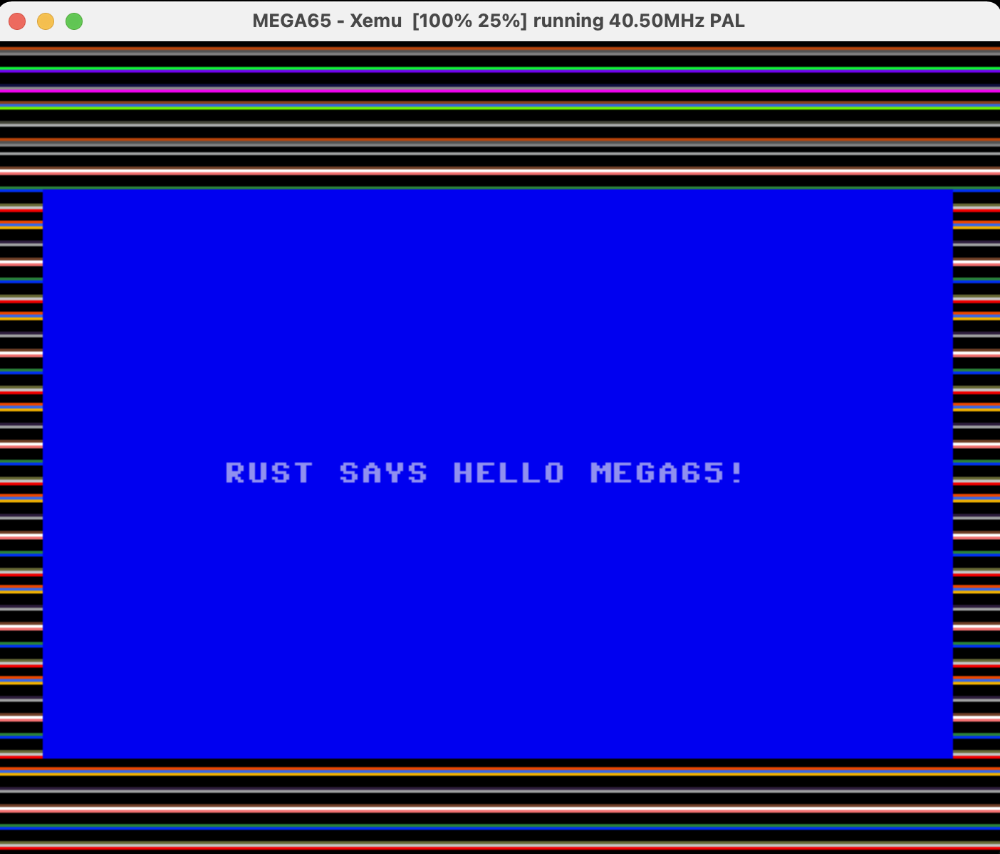

# MEGA65 Programming Playground

This is a playground for testing programming on the [MEGA65](https://mega65.org) 8-bit computer.

## Rust using llvm-mos

Amazingly, most core Rust features (`no_std` only) seem to work, including iterators and functional style
programming.
The `hello_rust` directory contains a simple example that compiles to a 6502 using
[llvm-mos](https://llvm-mos.org) from wrapped Rust code. It requires a working
Rust installation and the [llvm-mos-sdk](https://github.com/llvm-mos/llvm-mos-sdk#getting-started).
Compile and run on MEGA65 in c64 mode with:

~~~ bash
cd hello_rust
make
xmega65.native -prg main.prg -prgmode 64 # emulate in xemu
~~~

### Things to do:

- [x] Added convenience `peek` and `poke`
- [x] Begin mega66 rust module with hardware registers (see e.g. KickC headers)
- [ ] Inline assembler?
- [ ] Start in MEGA65 mode
- [ ] Wrap [mega65-libc](https://github.com/MEGA65/mega65-libc) to Rust?
- [ ] Use cargo

### Useful links

- http://forum.6502.org/viewtopic.php?p=84048#p84048
- https://gergo.erdi.hu/blog/2021-09-18-rust_on_the_mos_6502__beyond_fibonacci/

### Why?

Because I like MEGA65 and I like Rust.
